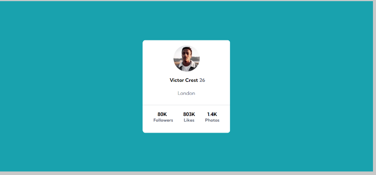
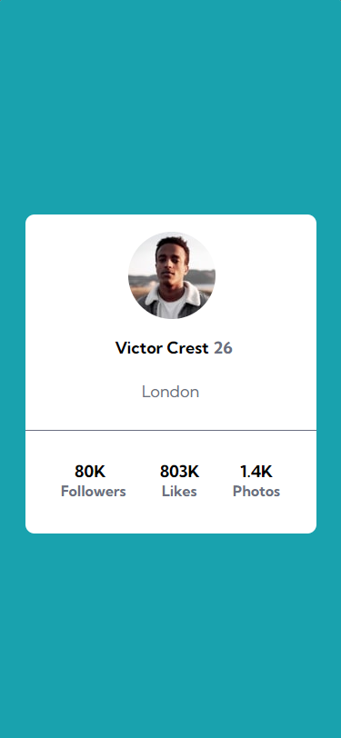

# Frontend Mentor - solução de componente de cartão de perfil.

Esta é uma das soluções para o desafio disponivel no Frontend Mentor (https://www.frontendmentor.io/challenges/profile-card-component-cfArpWshJ).

Usado para melhorar e fixar as habilidades e conhecimento de HTML e CSS Avançados com flex box.

 - Desafio:
Tinha como principal desafio deixar o cartão no meio da tela com o conteúdo centralizado  usando flex box CSS. Com responsividade em aparelhos Mobile.

* Desktop:

* Mobile:

-Processo:
Primeiramente realizei a análise do projeto para quebra-lo em pequenas etapas onde me levaria ao objetivo final.

- Tecnogologias:

 * HTML5
 * CSS3
 * Flex Box

O Objetivo:
o objetivo é de por em prática o conteúdo abordados nos módulos de HTML e CSS do iniciante ao avançado.